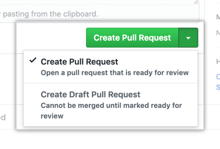

# Announcements 

- Thank you for coming! 
- You can find past versions of this deck in the Google Drive folder
  (http://bit.ly/2HdNXxQ)
   + If you're reading this in a PDF file, then this should be the newest version

--- 

## Housekeeping

- Check if you have Git installed in your system:
   + Windows: we recommend you to download Git Bash
   + Mac/Linux: open your terminal, and type `git --version`, it should be there.
- Check if you have the most common dev tools in your system:
   + NodeJS and npm for most web-development tasks
   + Python 3.X and pip for data science and etc.

For installation instructions, we recommend you to check thinkingmachines/gists
(or approach Mark Steve, Lj, or Jess)!

# What is Open Source Fridays?

Mix of knowledge sharing, hack sessions, and news updates regarding the
open-source ecosystem!

- Dedicating atleast 1.5 hours for open-source
- Spending some time to just build and learn stuff!
- No software development experience is required, everyone is welcome!
- We'll do this every week!

--- 

Open Source Fridays (OSF) aims to help you **skill-up** as an open-source
contributor! Here, we'll also **learn software best practices** that we can apply
in our daily work!

- Understanding Git
- Reviewing other's code
- Writing documentation
- Basic unit testing

*...and more!*

# Learning Goals

For today, we'll learn the following:

- How to make Pull Requests (PRs)
- How to write good commit messages
- How to handle conflict *(in code!)*

# What are Pull Requests?

**Pull Requests (PRs)** are proposals to change something in a codebase.

- Like a proposal, PRs are reviewed
   + If accepted, then it's merged to be part of the main codebase
   + It can also go through several iterations before merging
   + In some cases, PRs are outright declined

---

Pull requests are the currency in which open-source projects develop


# Task: On the ropes with Git!


**Step 1:** Clone the Open Source Fridays repository


\small

```
$ git clone git@github.com:thinkingmachines/open-source-fridays.git
```

\normalsize

## Concepts
- *Repository*: a folder that contains some files 
- *Cloning*: downloading a project in your computer


--- 

**Step 2:** Create a new branch `add/<my-name>` with your name 

```shell
$ git checkout -b add/<my-name>
```

:::::::::::::: {.columns}
::: {.column width="50%"}

## Concepts

- *Branch*: alt version of the repo
- `master`: the default branch
- Branches isolate our edits from prod

:::
::: {.column width="50%"}


:::
::::::::::::::

---

We normally name our branches depending on the edits we'll do:

```shell
git checkout -b add/ci
git checkout -b remove/cli-tool
git checkout -b update/logging
```

There's really no hard requirement for naming your branches as long as it's
understandable.

---

**Step 3:** Open `names.md` in your text editor, and add your name on the list!


---

**Step 4:** Add your changes so that git sees them

```shell
$ git add names.md
```

## Concepts
- Performing `git add` on your files puts them into staging mode
- Staging means you've not yet committed on these changes. You can still change your mind! (`git reset HEAD <file>`)


---

**Step 5:** If you're sure of your changes, then `commit` them! 

```shell
$ git commit -m "<Your commit message here>"
```

## Concepts

- Commit messages are like "labels" to identify the changes you've done.
- **Committing means sealing the deal**. That's it, it's in your history!
- We write commit messages in *imperative present* form (shot and sweet):
   + "Add 'lj' in names.md"
   + "Remove logging feature"
   + "Update API endpoint"

---

**Step 6**: Push changes to the repository

```shell
# git push [REMOTE] [BRANCH]
$ git push origin add/<my-name>
```

## Concepts

- *Remote*: is the link where your changes will be reflected onto (normally it's just in Github and is often designated by `origin`)
- *Remote Branch*: when proposing changes, we usually push to a remote feature-branch first (not `master`). Don't push directly to `master`, it's safer.

# Making the Pull Request

So far we've accomplished the following:

- Cloned a repository and made a new branch from it (`clone`, `checkout`)
- Updated the file `names.md` in our own branch
- Committed our changes (`add`, `commit`)
- Pushed our changes to the repository where we cloned it from (`push`)

---


---

*How can we then ask the project maintainer to check our proposal?*


# Task: Make your first Pull Request!

**Goal:** Make a Pull Request to `names.md` in the Open Source Fridays repo

First, navigate to the main page of the repository


---

:::::::::::::: {.columns}
::: {.column width="50%"}

Then in the "Branch" menu, choose the branch containing your commits

{ height=200px }

:::
::: {.column width="50%"}

To the right of the Branch menu, click **New pull request**

{ height=200px }

:::
::::::::::::::

---

Use the *base* branch dropdown menu to select the branch you'd like to merge into. 
In most cases, we simply just set the base branch to *master*

{ height=200px }

---

Type a title and description for your pull request. We recommend that the pull
request title be similar to a commit message header: short and sweet.

{ height=200px }

---

Lastly, create the Pull Request! If you think that the changes in your branch
are still work-in-progress, you can simply create a **Draft Pull Request**. The
maintainers won't be able to review nor merge it yet.

{ height=200px }
