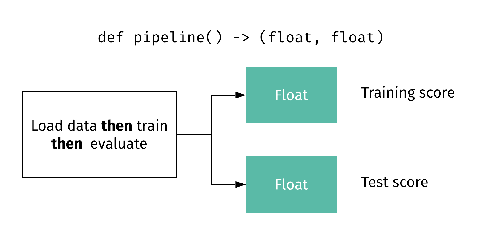

# Introduction 

In most open-source repositories, you'll see two types of code:

- **Business Logic**: code that defines the real-world business rules for your application
- **Tests**: code that checks if the business logic does what it's supposed to do.


# Learning Goals

For today, we'll learn the following:

- Modularizing your code so that they are "test-friendly."
- Learn about unit and integration testing.
- Writing and running tests using the `pytest` framework.


# Modularizing your code

**Modularization** means breaking your code into smaller, reusable, and logical
chunks that are easier to maintain and debug.

You might have a large Python function that does something like this:


# Modularizing your code

Ask yourself the ff questions when modularizing your code:

- How many times are you rewriting similar code for doing a particular task?
- How much code do you need to change when business logic changes?
- Are your chunks or components nearer to typical mental models for the given problem?
- Do your components perform adequately and independently as required?
- Can you compose your chunks together?

*What other questions can we ask?*


# Modularizing your code


# Modularizing your code

Good examples of libraries with nice API design:

- **scikit-learn**: all classifiers follow the `fit()`, `predict()` interface.
    Now the standard for classic ML implementations.
- **keras**: nice way of composing neural networks:

```python
from keras.layers import Dense

model.add(Dense(units=64, activation="relu"))
model.add(Dense(units=10, activation="softmax"))
```

# Task # 1: Modularizing your code

For today, we will **modularize and test a basic machine learning pipeline**.

* The pipeline involves classifying handwritten digits using Support-Vector Machines (SVM):

{ width=330px }

# Task # 1: Modularizing your code

## Instructions

1. Clone the `open-source-fridays` repo and go to the `OSF05_Writing-tests` directory.

```shell
$ git clone git@github.com:thinkingmachines/geomancer.git
```

2. Create a copy of `pipeline-problem.py` into `pipeline.py`:

```shell
$ cp pipeline-problem.py pipeline.py
```

3. Follow the refactoring instructions inside a file called `src.py`.

# On writing tests

There are usually two kinds of tests:

- **Unit tests**: checks each component (or unit) of your business logic
    + Does our function load the data correctly?
    + Does it raise an error given a wrong input?
- **Integration tests**: checks a specific use-case in your business logic
    + Does the whole pipeline work as expected?
    + Do our scores make sense?
    + Do our scores beat the benchmark?

# Writing tests with `pytest`: checking return values 


:::::::::::::: {.columns}
::: {.column width="40%"}

**Business logic**

```python
# arithmetic.py

def add(x,y):
    return x + y
```
:::
::: {.column width="60%"}

**Test code**

```python
# test_arithmetic.py

from arithmetic import add

def test_add_return_val():
    x = 5
    y = 3
    expected = 8
    sum_ = add(x,y)
    assert sum_ == expected
```

:::
::::::::::::::


# Writing tests with `pytest`: checking return types

:::::::::::::: {.columns}
::: {.column width="40%"}

**Business logic**

```python
# logic_gates.py

def not(x):
    return not x 
```
:::
::: {.column width="60%"}

**Test code**

```python
# test_logic_gates.py

from logic_gates import not

def test_return_not_type():
    not_0 = not(0)
    assert isinstance(not_0, bool)
```
:::
::::::::::::::


# Writing tests with `pytest`: parametrizing test inputs

:::::::::::::: {.columns}
::: {.column width="40%"}

**Business logic**

```python
# logic_gates.py

def not(x):
    return not x 
```
:::
::: {.column width="60%"}

**Test code**

```python
# test_logic_gates.py

from logic_gates import not

@pytest.mark.parametrize("x", 
    [0, 1, True, False])
def test_return_not_type(x):
    not_0 = not(x)
    assert isinstance(not_0, bool)
```
:::
::::::::::::::

# Writing tests with `pytest`: executing the test runner

To run tests, we simply execute the following command in our terminal:

```shell
$ pytest
```


Although I prefer verbose test logging:

```shell
$ pytest -v
```

# On testing

Some notes on testing:

- Tests can serve as documentation on how your code is used. Oftentimes, a well-tested codebase is a well-documented one.
- There is a practice called *Test Driven Design (TDD)*, this is where you write tests first then the business logic after.
- Tests are useful when refactoring your code: always ensure that all tests pass whenever you change a part of your codebase!
- Personally, writing tests gives me confidence in my code.

# Task # 2: Testing your code

## Instructions

Create a unit test file, `test_src.py` and test the following:

- that the `load()` function returns a tuple of length 4
- the number of samples returned by `load()` is correct given different `train_size`: `[0.25, 0.50, 0.75]`
- the `train()` method returns an instance of `svm.SVC` and a `float` 
- the `evaluate()` method returns a `float`

*What other things should we test? Feel free to do more!*

# Task # 2: Testing your code

## Instructions

Finally, create an integration test file, `test_pipeline.py` and test the following:

- that the `run_pipeline` command returns two `floats` for both training and test accuracy
- that the training and test accuracy checks out (will there be cases that the latter is greater than the former?)

*What other things should we test? Feel free to do more!*

# Final Notes

Some notes on testing and modularization:

- Compose and test in moderation
  + If your tests are too stringent, it might be difficult to refactor:
      * Sometimes it's fine to return a `list` or a `tuple`, no need to test that
  + In some cases, there's no need to test on values that your dependencies (the things you `import`, returns). 
      * The method `numpy.random.choice()` will always return a `numpy.ndarray`, no need to test that. Instead, test the business logic that uses this function.
- Modularization and composability is like an artform. Many people have different opinions on how to do it well. Just make sure that your most important use-cases are tested.
