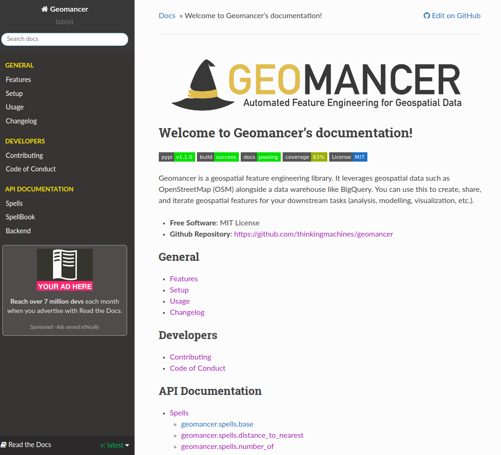
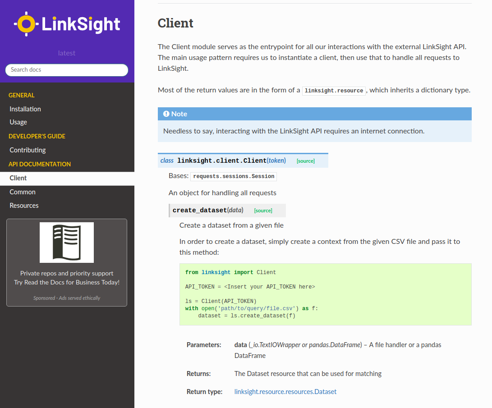

# Introduction

Welcome to the best part of open-source!

Today, we'll learn about writing documentation using Sphinx!

---

## Supersharing

- Writing documentation is probably the easiest way to onboard people inside
open-source projects.
- It allows people to contribute into open-source projects even without *deep*
  knowledge of the codebase.
- With tools like Sphinx, generating documentation can be a breeze! 

*What do we document anyway?*

---

# README

:::::::::::::: {.columns}
::: {.column width="60%"}

{ width=200% }

:::
::: {.column width="40%"}

## On writing READMEs

- Executive summary of your project. First thing people would see.
- A good template can be found in [makeareadme.com](https://www.makeareadme.com/)
- Oftentimes, its job is to (1) sell then (2) inform.
- Audience: 40% users, 40% non-users, 20% contributors

:::
::::::::::::::


# Project Documentation

Long-form version of your README. All roads lead to this doc.


:::::::::::::: {.columns}
::: {.column width="60%"}



:::
::: {.column width="40%"}

## RTFM! 

- For open-source, we host it on readthedocs.io 
- Everything from setup to usage should be found here.
- Audience: 60% users, 40% contributors


:::
::::::::::::::


# API Documentation

:::::::::::::: {.columns}
::: {.column width="60%"}



:::
::: {.column width="40%"}

## "How to use this method?"

- You don't wanna right this manually. Must be tied-in to your code.
- This is where tools like Sphinx, RMarkdown, or `go doc` come in
- Audience: 50% users, 50% contributors

:::
::::::::::::::


# Other sources of documentation

- **Issues and Pull Requests:** bigger projects tend to have Issue and PR templates
    so that bug reports, patches, and releases are well-documented.
- **Blog posts:** blog posts normally explore various use-cases for your
    open-source project. The sweet part is when other people write it for you!
- **Tests:** tests are good documentation too! It shows how each component of
    your code is used.

# Task: Documenting with Sphinx 

For this week, we'll learn how to create **Project and API Documentation**
using Sphinx:

- We'll first learn the ropes using a dummy project
- But in the end, our main goal is to create a nice documentation for `bqup`!

**First things first** We usually document Python code through its docstring. I
definitely recommend following the Numpy Docstring Guide.

--- 

## Documenting with Sphinx: Functions

\small
```python
def increment(x):
    """Brief description of the function
    
    Parameters
    ----------
    x : type
        Parameter description

    Returns
    -------
    type
        Description
    """
    return x + 1
```
---

## Documenting with Sphinx: Class

Documenting classes is similar to documenting functions. Sometimes we use the
`Attributes` header to document the "states" in the class (`self.x`, etc.)

```python
class Radio:
    """Brief description of the class
    
    A longer description
    """
    pass
```

---

Those are the basic ways to document your Python files. You can definitely find
more information in the [**Numpy Docstring
Guide**](https://sphinxcontrib-napoleon.readthedocs.io/en/latest/index.html).

For now, we'll use the knowledge we have to document the `calculator.py` file

## Step 1: Document a dummy calculator project

1. Clone the `thinkingmachines/open-source-fridays` repository
2. Go to `OSF06_Documenting-your-projects`
3. Create a virtual environment (`make venv`)
4. Open `calculator.py`

You should see an undocumented class, `Calculator`, with undocumented methods.
You know what to do!

---

## Step 2: Generating documentation with Sphinx

Sphinx allows us to create HTML, PDF, or EPUB versions of our documentation. It
reads the docstring that we made, and turn that into human-friendly formats.

Install documentation dependencies on `requirements-dev.txt`:

- `Sphinx>=2.1.0`
- `sphinx_rtd_theme`
- `sphinxcontrib-napoleon`

**Question:** Why do we put these dependencies on dev?

---

## Step 3: Set-up docs directory with Sphinx 

1. Create a directory, `docs`
2. Run `sphinx-quickstart`, follow the prompt! 

This will generate multiple files inside your `docs` directory:

- `_build`: contains all build artifacts
- `_static`: for storing assets like CSS, images, etc. 
- `_templates`: for HTML/LaTeX customization
- `Makefile` or `make.bat`: recipes for generating docs
- `conf.py`: Sphinx configuration file (important!)
- `index.rst`: Root location where sphinx will generate its docs

---

## Step 4: An empty documentation

1. Let's try running the `make` command to see what an empty documentation
   looks like

   ```shell
   make html
   ```

2. Go to `_build/html`, you should see an `index.html`. Open this using your
   favorite web browser

**Question:** Can you try running `make pdf`? What will you see?

---

## Step 5: Populating our documentation

1. Remember `index.html`? It was generated from `index.rst`. Open it! 

    **Note**
    An RST (ReStructured Text) file is a markup file just like Markdown. 
    It's a bit fancier and integrates nicely with Sphinx.

2. Create a new file, `setup.rst` and put the following inside:

    ```
    # setup.rst

    Setup
    =====

    Hello from OSF!
    ```

--- 

3. Inside `index.rst`, write `setup.rst` below the `toctree`:

    ```
    .. toctree::
        :maxdepth: 2
        :caption: Contents:

        setup
    ```

    No need to put the file extension!

4. Regenerate the HTML file (you remember how to do it, right?)

---

## Step 6: Creating API documentation

Now, we need to generate an RST file for `calculator.py`. To accomplish this,
we use `sphinx-autodoc`.


```shell
$ sphinx-apidoc -o api ../ -T
```

Inspect the output `api/calculator.rst`. That is the autogenerated
documentation from your docstring.

---

## Step 7: Configuring Sphinx

- Cool, we now have an autogenerated API doc from our docstring
- But Sphinx still won't be able to recognize that. We need to add some extensions

1. Open `conf.py`
2. Update the `extensions = []` with the following:

```python
extensions = [
    "sphinx.ext.autodoc",
    "sphinx.ext.napoleon"
]
```

--- 

3. You might also want to uncomment the following in your `conf.py`:

```python
import os
import sys
sys.path.insert(0, os.path.abspath('../'))
```

We're doing this because we're only documenting one file (`calculator.py`).

---

## Step 8: Adding API documentation

Usually, we set the API documentation as another `toctree` in `index.rst`.  

1. Try creating another `toctree` with `:maxdepth:2` and `:caption: API Documentation` in `index.rst`.
2. Be sure to add the path `api/calculator` (no need for extension) under this
   TOC tree
3. Now, regenerate the HTML file and check if your API documentation shows up!


---

## Step 9: Experiment!

Here are some things you should try out:

1. Right now we're using the `alabaster` theme. Try changing that in `conf.py`.
   You can check all available themes in https://sphinx-themes.org/
2. Add more files in your `Contents` TOC. Try creating dummy files for
   `usage.rst`, `contributing.rst`, etc. 
3. Try out an extension! How can I put LaTeX equations in RST? This is not
   built-in with Sphinx so you need to install the appropriate extension.

---

## Step 10: Let's go document bqup!

As a good open-source output, we should definitely document bqup. Our goal is
to upload the project documentation to ReadTheDocs. Here are some of the tasks
that we can do:

- Add docstrings for every class and method
- Improve the README
- Add installation, setup, and usage guides
- Setup ReadTheDocs

One of us (Lj, Jess, or Steve) will setup a branch with the `docs` directory,
and you should branch from that.

# Resources

We've just touched the surface of Python documentation. There's still a lot to
learn!

- Awesome SphinxDoc:https://github.com/yoloseem/awesome-sphinxdoc 
- WriteTheDocs: https://www.writethedocs.org 
- nbsphinx (Jupyter to RST): https://nbsphinx.readthedocs.io/en/0.4.2/ 
- ReadTheDocs (hosting): https://readthedocs.io/ 

# Wishlist

Wanna contribute to the whole documentation culture in TM? Here's my wishlist:

- Our own Sphinx template that is consistent with TM Branding 
- Internal ReadTheDocs/GoDoc server to host internal documentation
- Continuous checking and documentation of our current open-source projects!
