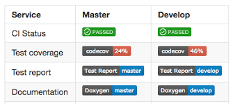

# Software -> Prod

Continuous integration is the process of putting software into production:

- Publishing Python libraries in PyPI
- Compiling and distributing software to your users (`apt-get`, `brew install`)
- Building and serving a website

---

## For today, we'll learn/do the following...

- Learn about the continuous integration ecosystem in TM 
- Write a deployment file for an existing open-source/internal project!
- Get **badges** for that project!!

---





---

## Behind the scenes before your `pip install` 


# Considerations when deploying to production

:::::::::::::: {.columns}
::: {.column width="40%"}

**Ideally, it should be...**

* Bug-free
* Working in different machines (reproducible) 
* Always updated 

:::
::: {.column width="60%"}

**However...**

* How can you easily redeploy software when a user found a bug?
* How can you define your environment and test on different machines?
* How can you release your software easily?


:::
::::::::::::::


# Continuous integration

- Simulates the process of installing and running your software in a "clean" computer
- Just a **configuration file** where various steps are specified (by us!) 
- Common CI/CD steps: `install -> test -> publish`
- These configuration files are executed by CI platforms

---

## Common CI/CD platforms we've been using here in TM 


# Continuous integration at TM 


## Geomancer (Drone Cloud)


---

## Tiffany (Drone Cloud)


--- 

## Spade (Internal Drone)


# One file to rule them all

A sample `.drone.yml` file. 

\small

```yaml
kind: pipeline
name: run-tests

steps:
- name: test
  image: python:3.6-stretch
  commands:
  - pip install -r requirements-dev.txt
  - pytest tests/
```

# Task

- Fb-scraper
- PizaPy
- BertSum
- BQUP
